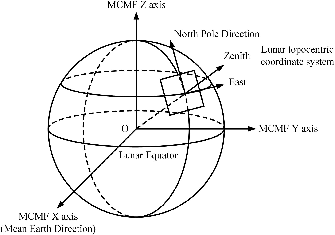

# lunarsky


[](https://github.com/aelanman/lunarsky/actions)
[](https://codecov.io/gh/aelanman/lunarsky)


An extension to `astropy`, providing selenocentric and topocentric reference frames
for the Moon and transformations of star positions from the ICRS system to these
frames. This is to describe the sky as observed from the surface of the Moon.

Non-relativistic transformations are calculated using the SPICE toolkit. Relativistic
corrections (stellar aberration) will be added.


## Dependencies
* `numpy`
* `astropy>=3.0`
* `jplephem`
* `spiceypy`

## Installation

`lunarsky` may be installed with pip:

```
pip install lunarsky
```

or from the repository:
```
git clone https://github.com/aelanman/lunarsky
python setup.py install
```

## Usage



Definition of the MCMF and lunar topocentric frames, from Fig. 2 of [Ye et al.][1]

`lunarsky` provides the following classes:

* `MCMF` – The "Moon-Centered-Moon-Fixed" frame, this is a cartesian reference frame that rotates
with the moon. This is chosen to be the Mean Earth/Polar frame, with a Z axis defined by the mean rotation axis of the Moon and a prime meridian defined by the mean direction to the Earth's center (the X axis is through this meridian 90° from the Z axis, and Y is defined such that XYZ is a right-handed system). This is analogous to `astropy.coordinates.builtin.ITRS`.
* LunarTopo – A topocentric (East/North/Up) frame defined at a position on the Moon's surface. This is analogous to `astropy.coordinates.builtin.AltAz`.
* `MoonLocation` – Analogous to the `astropy.coordinates.EarthLocation` class, this describes
positions on the Moon in either selenocentric (x, y, z) or selenodetic (lat, lon, height) coordinates.
The cartesian axes of the selenocentric system are those of the MCMF frame. In the selenodetic coordinates, "height" is defined relative to a sphere of radius 1737.1 km.
* `SkyCoord` – A replacement for `astropy.coordinates.SkyCoord`, with modifications that ensure compatibility with the `MoonLocation` class.
* `Time` – A replacement for the `astropy.time.Time` class, which can accept a `MoonLocation` instance as its location parameter, allowing for the calculation of local sidereal times on the Moon. The LST of an observer on the Moon is defined as the right ascension of the zenith.


## Credit

This package makes use fo the ``spiceypy`` wrapper [2] for the JPl SPICE Toolkit, produced by the NASA Navigation and Ancillary Information Facility (NAIF) [3] [4]. The transformations are defined using data in kernel files ``pck/moon_pa_de421_1900-2050.bpc``, ``moon_080317.tf``, and ``moon_assoc_me.tf``. These may be found at [the NAIF website](https://naif.jpl.nasa.gov/pub/naif/generic_kernels), and were produced by Nat Bachman (NAIF/JPL) in March 2008. Further information may be found in the comments in these files in the `data` directory.

## References
[1]: Ye, Hanlin, et al. "Looking Vector Direction Analysis for the Moon-Based Earth Observation Optical Sensor." IEEE Journal of Selected Topics in Applied Earth Observations and Remote Sensing, vol. 11, no. 11, Nov. 2018, pp. 4488–99. IEEE Xplore, doi:10.1109/JSTARS.2018.2870247.

[2]: Annex et al., (2020). SpiceyPy: a Pythonic Wrapper for the SPICE Toolkit. Journal of Open Source Software, 5(46), 2050, https://doi.org/10.21105/joss.02050

[3]: Acton, C.H.; "Ancillary Data Services of NASA's Navigation and Ancillary Information Facility;" Planetary and Space Science, Vol. 44, No. 1, pp. 65-70, 1996.

[4]: Charles Acton, Nathaniel Bachman, Boris Semenov, Edward Wright; A look toward the future in the handling of space science mission geometry; Planetary and Space Science (2017); DOI 10.1016/j.pss.2017.02.013; https://doi.org/10.1016/j.pss.2017.02.013
